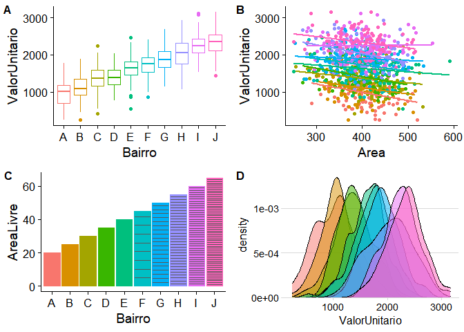
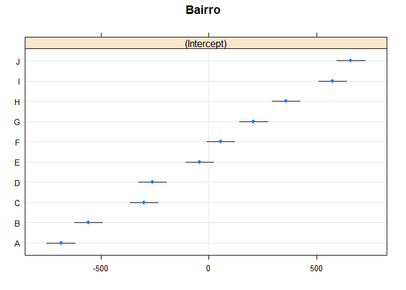

# Estudo de Caso

## Criação de dados via simulação

Foram criados 1000 dados a partir de simulação com o auxílio do software **R**.

Os dados foram criados conforme parâmetros da tabela 1,

| Variável              | Tipo          | Distribuição | Parâmetros                      | Obs                       |
|:----------------------|--------------:|:------------:|--------------------------------:|:-------------------------:|
| Área ($A$)            | Quantitativa  | Normal       | $\mu = 400, \sigma = 50$        |  -                        |
| Bairro                | Qualitativa   | -            | A a J                           |  -                        |
| Áreas Verdes ($A_V$)  | Quantitativa  | Uniforme     | $\mu = 0,2 \quad a \quad 0,65$  |Um valor para cada bairro  |
| $\beta_{0}$           | Coeficiente   | Discreta     | 1000                            |  -                        |
| $\upsilon$            | Termo de erro | Normal       | $\mu = 0, \sigma = 300$         |  -                        |
| $\beta_{0j}$          | Coeficiente   | Não definida | $\beta_0 + 3000A_V + \upsilon$  |  -                        |
| $\epsilon$            | Termo de erro | Normal       | $\mu = 0, \sigma = 100$         |  -                        |
| Valor Unitário ($VU$) | Quantitativa  | Não definida | $\beta_{0j} - 1,5 A + \epsilon$ |  -                        |  

## Análise exploratória dos dados

Na figura \ref{fig:exploratoria} é possível ver os principais gráficos dos dados
gerados.

Análise exploratória dos dados.

## Modelo de efeitos fixos

Com os dados gerados, foi elaborado um modelo de efeitos fixos, do tipo:

$$ValorUnitario = \beta_0 + \beta_1Area + \beta_{2i}Bairro_i + \epsilon$$
onde $\beta_{2i}$ são os coeficientes das variáveis dicotômicas em grupo ($Bairro_i$).

## Modelo de efeitos mistos

Também foi elaborado um modelo misto do tipo:

$$ValorUnitario = \beta_0 + \beta_1Area + \upsilon_i + \epsilon$$
Onde $\upsilon_i$ é uma variável aleatória que foi utilizada para modelar os
diferentes bairros.

## Resultados

As estatísticas básicas dos coeficientes podem ser observadas na tabela \ref{tab:fits}.

Como pode ser vistos nesta tabela, o valor do intercepto global (a dita grande 
média) do modelo de efeitos mistos é de R\$ 2.219,95.

Os efeitos aleatórios do modelo misto podem ser visualizados na Figura \ref{fig:dotplot}.

Como se pode notar na Figura \ref{fig:dotplot}, os valores dos interceptos
aleatórios para cada bairro giram em torno de zero, o seu valor médio.

Os valores de referência para cada bairro podem ser obtidos através da soma do
intercepto global do modelo misto com os interceptos aleatórios, o que pode ser
visto na tabela \ref{tab:somaitcpt}.

<table style="text-align:center"><caption><strong>Comparacão dos modelos de efeitos fixos e efeitos mistos.</strong></caption>
<tr><td colspan="3" style="border-bottom: 1px solid black"></td></tr><tr><td style="text-align:left"></td><td colspan="2"><em>Dependent variable:</em></td></tr>
<tr><td></td><td colspan="2" style="border-bottom: 1px solid black"></td></tr>
<tr><td style="text-align:left"></td><td colspan="2">ValorUnitario</td></tr>
<tr><td style="text-align:left"></td><td><em>OLS</em></td><td><em>linear</em></td></tr>
<tr><td style="text-align:left"></td><td><em></em></td><td><em>mixed-effects</em></td></tr>
<tr><td style="text-align:left"></td><td>(1)</td><td>(2)</td></tr>
<tr><td colspan="3" style="border-bottom: 1px solid black"></td></tr><tr><td style="text-align:left">Constant</td><td></td><td>2.220,0 (159,7)***</td></tr>
<tr><td style="text-align:left">Area</td><td>-1,4 (0,2)***</td><td>-1,4 (0,2)***</td></tr>
<tr><td style="text-align:left">BairroA</td><td>1.529,8 (88,5)***</td><td></td></tr>
<tr><td style="text-align:left">BairroB</td><td>1.657,9 (87,2)***</td><td></td></tr>
<tr><td style="text-align:left">BairroC</td><td>1.916,5 (87,8)***</td><td></td></tr>
<tr><td style="text-align:left">BairroD</td><td>1.957,4 (88,0)***</td><td></td></tr>
<tr><td style="text-align:left">BairroE</td><td>2.176,5 (87,1)***</td><td></td></tr>
<tr><td style="text-align:left">BairroF</td><td>2.274,5 (87,1)***</td><td></td></tr>
<tr><td style="text-align:left">BairroG</td><td>2.427,9 (85,6)***</td><td></td></tr>
<tr><td style="text-align:left">BairroH</td><td>2.578,7 (87,5)***</td><td></td></tr>
<tr><td style="text-align:left">BairroI</td><td>2.794,3 (87,6)***</td><td></td></tr>
<tr><td style="text-align:left">BairroJ</td><td>2.881,3 (87,6)***</td><td></td></tr>
<tr><td colspan="3" style="border-bottom: 1px solid black"></td></tr><tr><td style="text-align:left">Observations</td><td>1.000</td><td>1.000</td></tr>
<tr><td style="text-align:left">Adjusted R2</td><td>1,0</td><td></td></tr>
<tr><td style="text-align:left">Log Likelihood</td><td></td><td>-7.244,7</td></tr>
<tr><td style="text-align:left">Akaike Inf. Crit.</td><td>14.451,7</td><td>14.497,3</td></tr>
<tr><td style="text-align:left">Bayesian Inf. Crit.</td><td>14.510,6</td><td>14.516,9</td></tr>
<tr><td style="text-align:left">Residual Std. Error</td><td>330,4 (df = 989)</td><td></td></tr>
<tr><td style="text-align:left">F Statistic</td><td>2.492,4*** (df = 11; 989)</td><td></td></tr>
<tr><td colspan="3" style="border-bottom: 1px solid black"></td></tr><tr><td style="text-align:left"><em>Note:</em></td><td colspan="2" style="text-align:right">*p<0,3; **p<0,2; ***p<0,1</td></tr>
</table>

Efeitos aleatórios do modelo.

<table class="table" style="font-size: 10px; margin-left: auto; margin-right: auto;">
<caption style="font-size: initial !important;">Valores dos interceptos para cada bairro.</caption>
 <thead>
  <tr>
   <th style="text-align:left;">   </th>
   <th style="text-align:right;"> A </th>
   <th style="text-align:right;"> B </th>
   <th style="text-align:right;"> C </th>
   <th style="text-align:right;"> D </th>
   <th style="text-align:right;"> E </th>
   <th style="text-align:right;"> F </th>
   <th style="text-align:right;"> G </th>
   <th style="text-align:right;"> H </th>
   <th style="text-align:right;"> I </th>
   <th style="text-align:right;"> J </th>
  </tr>
 </thead>
<tbody>
  <tr>
   <td style="text-align:left;"> (Intercept) </td>
   <td style="text-align:right;"> 1.534,2 </td>
   <td style="text-align:right;"> 1.661,6 </td>
   <td style="text-align:right;"> 1.918,7 </td>
   <td style="text-align:right;"> 1.959,3 </td>
   <td style="text-align:right;"> 2.177,2 </td>
   <td style="text-align:right;"> 2.274,7 </td>
   <td style="text-align:right;"> 2.427,1 </td>
   <td style="text-align:right;"> 2.577,2 </td>
   <td style="text-align:right;"> 2.791,5 </td>
   <td style="text-align:right;"> 2.878 </td>
  </tr>
</tbody>
</table>

Como se pode perceber, quase não houve diferença entre os valores estimados em 
cada modelo.

A ínica informação a mais que se pode extrair do modelo de efeitos mistos é
a componente de variância devido à localidade, separada da variância ao nível 
dos imóveis, o que pode ser visto na tabela \ref{tab:variancias}. 

<table class="table" style="margin-left: auto; margin-right: auto;">
<caption>Efeitos randômicos do modelo misto.</caption>
 <thead>
  <tr>
   <th style="text-align:left;"> grp </th>
   <th style="text-align:right;"> vcov </th>
   <th style="text-align:right;"> sdcor </th>
  </tr>
 </thead>
<tbody>
  <tr>
   <td style="text-align:left;"> Bairro </td>
   <td style="text-align:right;"> 188.643,9 </td>
   <td style="text-align:right;"> 434,33 </td>
  </tr>
  <tr>
   <td style="text-align:left;"> Residual </td>
   <td style="text-align:right;"> 109.080,0 </td>
   <td style="text-align:right;"> 330,27 </td>
  </tr>
</tbody>
</table>

Pode-se notar que a variância devido à localidade é relevante para o modelo, haja
vista que a variância devido à localidade é maior do que a variância devido às
características dos imóveis.

## Modelo com variáveis de segundo nível

Finalmente, foi elaborado um modelo misto do tipo:

$$ValorUnitario = \beta_0 + \beta_1Area + \beta_2 A_V+ \upsilon_i + \epsilon$$

Onde $A_V$ é uma variável de nível 2 que representa a porcentagem de áreas 
verdes em cada bairro, em relação à área total.

A tabela \ref{tab:fits2} mostra as estatísticas básicas deste modelo comparado
aos dois modelos previamente estudados.

<table style="text-align:center"><caption><strong>Comparacão dos modelos de efeitos fixos e efeitos mistos.</strong></caption>
<tr><td colspan="4" style="border-bottom: 1px solid black"></td></tr><tr><td style="text-align:left"></td><td colspan="3"><em>Dependent variable:</em></td></tr>
<tr><td></td><td colspan="3" style="border-bottom: 1px solid black"></td></tr>
<tr><td style="text-align:left"></td><td colspan="3">ValorUnitario</td></tr>
<tr><td style="text-align:left"></td><td><em>OLS</em></td><td colspan="2"><em>linear</em></td></tr>
<tr><td style="text-align:left"></td><td><em></em></td><td colspan="2"><em>mixed-effects</em></td></tr>
<tr><td style="text-align:left"></td><td>(1)</td><td>(2)</td><td>(3)</td></tr>
<tr><td colspan="4" style="border-bottom: 1px solid black"></td></tr><tr><td style="text-align:left">Constant</td><td></td><td>2.220,0 (159,7)***</td><td>932,5 (90,5)***</td></tr>
<tr><td style="text-align:left">Area</td><td>-1,4 (0,2)***</td><td>-1,4 (0,2)***</td><td>-1,4 (0,2)***</td></tr>
<tr><td style="text-align:left">BairroA</td><td>1.529,8 (88,5)***</td><td></td><td></td></tr>
<tr><td style="text-align:left">BairroB</td><td>1.657,9 (87,2)***</td><td></td><td></td></tr>
<tr><td style="text-align:left">BairroC</td><td>1.916,5 (87,8)***</td><td></td><td></td></tr>
<tr><td style="text-align:left">BairroD</td><td>1.957,4 (88,0)***</td><td></td><td></td></tr>
<tr><td style="text-align:left">BairroE</td><td>2.176,5 (87,1)***</td><td></td><td></td></tr>
<tr><td style="text-align:left">BairroF</td><td>2.274,5 (87,1)***</td><td></td><td></td></tr>
<tr><td style="text-align:left">BairroG</td><td>2.427,9 (85,6)***</td><td></td><td></td></tr>
<tr><td style="text-align:left">BairroH</td><td>2.578,7 (87,5)***</td><td></td><td></td></tr>
<tr><td style="text-align:left">BairroI</td><td>2.794,3 (87,6)***</td><td></td><td></td></tr>
<tr><td style="text-align:left">BairroJ</td><td>2.881,3 (87,6)***</td><td></td><td></td></tr>
<tr><td style="text-align:left">AreaLivre</td><td></td><td></td><td>3.023,0 (87,5)***</td></tr>
<tr><td colspan="4" style="border-bottom: 1px solid black"></td></tr><tr><td style="text-align:left">Observations</td><td>1.000</td><td>1.000</td><td>1.000</td></tr>
<tr><td style="text-align:left">Adjusted R2</td><td>1,0</td><td></td><td></td></tr>
<tr><td style="text-align:left">Log Likelihood</td><td></td><td>-7.244,7</td><td>-7.211,5</td></tr>
<tr><td style="text-align:left">Akaike Inf. Crit.</td><td>14.451,7</td><td>14.497,3</td><td>14.433,1</td></tr>
<tr><td style="text-align:left">Bayesian Inf. Crit.</td><td>14.510,6</td><td>14.516,9</td><td>14.457,6</td></tr>
<tr><td style="text-align:left">Residual Std. Error</td><td>330,4 (df = 989)</td><td></td><td></td></tr>
<tr><td style="text-align:left">F Statistic</td><td>2.492,4*** (df = 11; 989)</td><td></td><td></td></tr>
<tr><td colspan="4" style="border-bottom: 1px solid black"></td></tr><tr><td style="text-align:left"><em>Note:</em></td><td colspan="3" style="text-align:right">*p<0,3; **p<0,2; ***p<0,1</td></tr>
</table>

Pode-se notar que este último modelo estimou precisamente os valores como 
simulados. Primeiramente, deve-se notar que o valor da influência das áreas
verdes, simulado como aumento R\$ 3.000,00/m2 a cada ponto percentual a mais de
áreas verdes no bairro do imóvel, foi precisamente estimado. 

Também deve-se notar que o valor de $\beta_0$, o intercepto reflete muito melhor
o valor atribuído a este coeficiente na simulação dos dados (1.000,00). Isto
ocorre porque o efeito da variável relevante $A_V$ não inclusa no modelo 
anterior havia sido absorvida por este coeficiente.

Por último, porém não menos relevante, percebe-se que este modelo tem critérios
de informação de Akaike (AIC) e de Bayes (BIC) melhores que os dois modelos 
iniciais.

