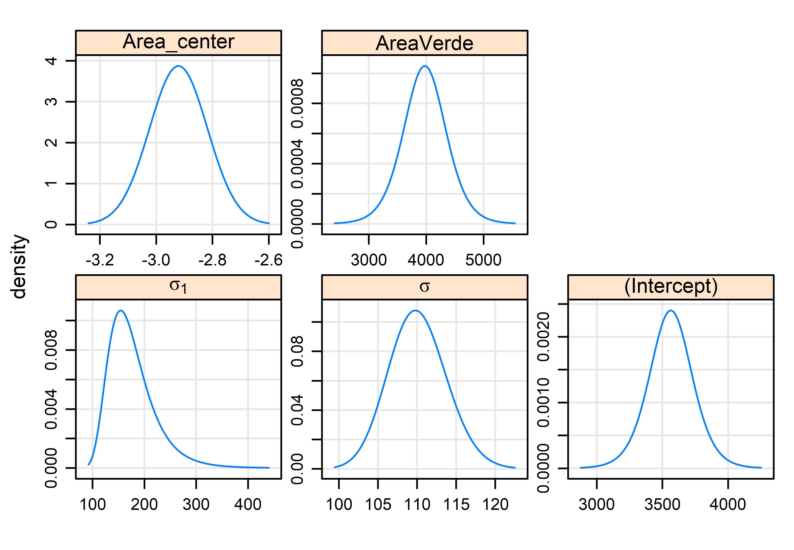
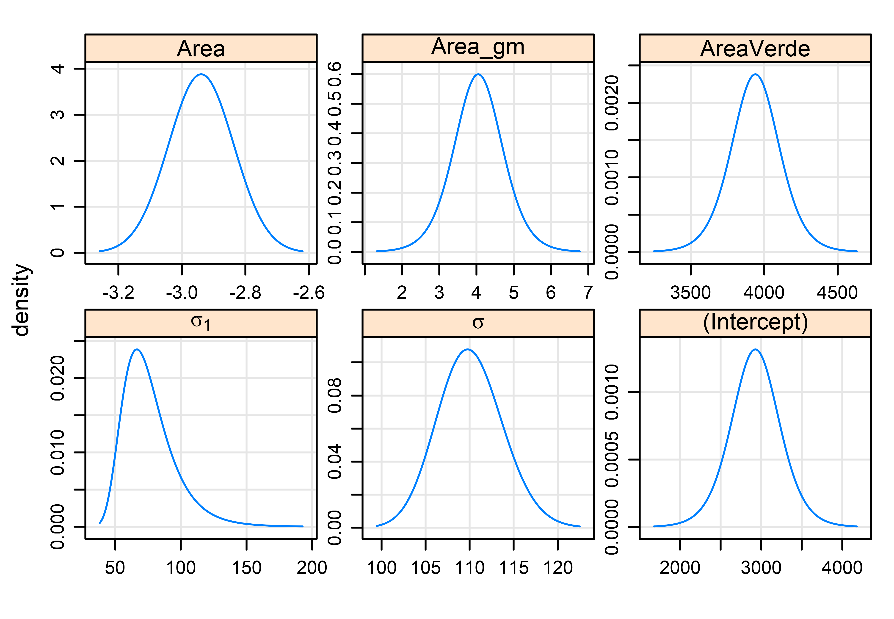

# Introdução

Na Engenharia de Avaliações, assim como em diversos ramos das ciências
sociais, a abordagem padrão para lidar com a heteregoneidade amostral é
a modelagem com efeitos fixos. Este tipo de abordagem permite a
segregação dos dados da amostra em diferentes agrupamentos, no entanto,
ela não...

# Revisão Bibliográfica

A análise de dados multinível é usualmente feita, nos diversos ramos da
ciência por meio de modelos de efeitos fixos. No entanto, de acordo com Bell *et al.*
[-@bell2019, 1052], os modelos mistos bem especificados oferecem uma abordagem
muito mais completa destes tipos de dados do que a modelagem por efeitos fixos.

Segundo Bell *et al.* [-@bell2019, 1051], existe uma confusão na literatura a
respeito de modelos mistos, no que tange à aglutinação em uma modelagem de
diversos tipos de efeitos, fixos e aleatórios, sendo que os modelos mistos mais
complexos tem sido chamados, erroneamente, de modelos híbridos.

## Modelagem por efeitos fixos

A modelagem por efeitos fixos é frequentemente aplicada na Engenharia de 
Avaliações, assim como em diversas outras áreas da ciência [@bell2019, 1057], 
apesar desta terminologia não ser normalmente empregada.

Um modelo de efeitos fixos nada mais é do que um modelo em que a heterogeneidade 
da amostra é "saneada" através da inclusão de variáveis *dummies*[^1]
representando cada agrupamento de dados. Após a inclusão destas variáveis
saneando a amostra, ou seja, tornando-a homogênea, a estimação é feita pelo
métodos dos mínimos quadrados ordinários.

[^1]: Neste trabalho as variáveis dicotômicas em grupo serão tratadas 
simplesmente pelo termo em inglês *dummies*.

A modelagem por efeitos fixos pode ser escrita conforme a equação \ref{eq:fixef},
onde a variância entre os agrupamentos de dados (variância de nível mais alto)
é modelada através de variáveis *dummies* $D_j$ [@bell2015, 138]:

\begin{equation} \label{eq:fixef}
y_{ij} = \sum_{j=1}^{j}\beta_{0j}D_j + \beta_1 x_{ij} + \epsilon_{ij}
\end{equation}

No entanto, uma outra maneira mais conveniente - para a comparação que
se pretende de escrever a formulação de efeitos fixos, equivalente à
primeira, pode ser vista na equação \ref{eq:fixef2} [@bell2019, 1058]:

\begin{equation} \label{eq:fixef2}
y_{ij} = \beta_1 (x_{ij} - \bar{x}_j) + (\upsilon_i + \epsilon_{ij}) 
\end{equation}

Onde $\upsilon_i$ é um termo discreto para cada agrupamento de dados[^2]. Os
índices $i$ e $j$ se referem aos dois níveis de análise: $i$, neste caso,
representa o nível dos indivíduos e $j$ o nível dos agrupamentos.
$\epsilon_{ij}$ é um termo de erro aleatório com distribuição supostamente
normal, média zero e desvio-padrão $\sigma_{\epsilon}^2$.

[^2]: O termo $\upsilon_i$ é o intercepto de cada agrupamento, quando se 
ajusta um modelo sem intercepto.

Na prática, no entanto, a formulação acima raramente é utilizada, pois
perde-se um grau de liberdade na estimação de um intercepto para cada
bairro, quando se pode utilizar um nível de referência e estimar apenas
a diferença entre os níveis de cada agrupamento em relação a este nível
de referência, como ilustrado na equação \ref{eq:fixef3} [@bell2019, 1058]:

\begin{equation} \label{eq:fixef3}
(y_{ij} - \bar{y}_i) = \beta_1 (x_{ij} - \bar{x}_j) + (\epsilon_{ij}) 
\end{equation}

## Modelagem por efeitos mistos

Existem diversas maneiras de utilização da modelagem por efeitos mistos.
Neste trabalho apresentam-se as diversas possibilidades, desde a
abordagem mais simples, que possibilita uma melhor comparação com o
modelo de efeitos fixos, muito conhecido na Engenharia de Avaliações,
até a abordagem mais complexa, a formulação REWB.

### Modelo de efeitos mistos simples

A modelagem por efeitos mistos considera, além dos efeitos fixos, um
termo de efeitos aleatórios [@bell2019, 1059]. Uma das maneiras de
escrever a formulação de efeitos mistos pode ser vista na equação
\ref{eq:mixef}.

\begin{equation} \label{eq:mixef}
y_{ij} = \beta_0 + \beta_1^{RE} x_{ij} + \beta_2 z_j + (\upsilon_j + \epsilon_{ij}) 
\end{equation}

No caso da equação \ref{eq:mixef}, o termo $\upsilon_j$ é um termo
estocástico de efeitos aleatórios para os indivíduos, suposto
normalmente distribuído e com média zero, ou seja
$\upsilon_j \sim N(0, \sigma_{\upsilon}^2)$ [@bell2019, 1055]. A variável $x_{ij}$
é uma variável de nível 1, variante entre os diferentes agrupamentos e a
variável $z_j$ é uma variável de nível 2, considerada invariante entre
os agrupamentos. Neste tipo de modelagem estimam-se, além dos
coeficientes das variáveis de nível mais baixo $\beta_0$ e
$\beta_1$, o(s) coeficiente(s) da(s) variável(eis) de segundo nível
$\beta_2$ e os parâmetros $\sigma_\upsilon^2$ e
$\sigma_\epsilon^2$, ou seja, as variâncias de primeiro e segundo
nível, respectivamente.

A diferença de nível entre as variáveis pode ser melhor compreendida ao
se dividir a modelagem em dois níveis (alguns autores se referem a este
tipo de modelagem como hierárquica), como pode ser visto nas equações
\ref{eq:micro} e \ref{eq:macro}:

\begin{equation} \label{eq:micro}
y_{ij} = \beta_{0j} + \beta_1^{RE} x_{ij} + \epsilon_{ij} 
\end{equation}

\begin{equation} \label{eq:macro}
\beta_{0j} = \beta_0 + \beta_2 z_{j} + \upsilon_{j} 
\end{equation}

Segundo Bell e Jones [-@bell2015, 135-136], a equação \ref{eq:micro} é chamada 
de parte micro, enquanto a equação \ref{eq:macro} é chamada de parte macro da 
formulação de efeitos mistos, que são estimadas em conjunto ao substituir 
\ref{eq:macro} em \ref{eq:micro} para se obter o modelo misto da equação 
\ref{eq:mixef}.

Em suma, para Bell \emph{et al.} [-@bell2019, 1061], a grande diferença
entre a formulação de efeitos fixos e a formulação de efeitos mistos
está na maneira como as modelagens tratam os agrupamentos de dados, se
de maneira discreta (efeitos fixos) ou de maneira aleatória (efeitos
aleatórios). Enquanto na modelagem de efeitos fixos são adicionadas
variáveis \emph{dummies} discretas para a modelagem dos diferentes
agrupamentos, na modelagem de efeitos aleatórios é considerado que a
diferença entre os dados de diferentes agrupamentos pode ser modelada
por uma variável aleatória normal. Assim, os modelos de efeitos fixos
consomem todos os graus de liberdade do segundo nível hierárquico ,
matando assim a possibilidade de inferências a respeito da variância em
nível mais alto, sendo impossível medir os efeitos de variáveis como
$z_j$, na equação \ref{eq:mixef} [@bell2015, 139].

Segundo os autores citados, ainda, esta visão não é unânime: na
econometria, por exemplo, é considerado que a diferença fundamental
entre as modelagens de efeitos fixos e efeitos mistos está de fato na
hipótese considerada pelos modelos mistos de que não há correlação dos
efeitos aleatórios (representados por $\upsilon_i$) e os regressores
($x_ij$), o que é permitido na modelagem de efeitos fixos [@bell2019, 1060].

Este tipo de modelagem ainda pode ser facilmente estendida para incorporar
outros níveis hierárquicos mais altos, assim como variabilidade não apenas para
os interceptos, mas também para os coeficientes das variáveis explicativas
[@bell2019, 1052].

### Formulação de Mundlak

Esta formulação consiste da introdução de um termo adicional à parte macro do 
modelo, que leva em conta a variação entre os grupos (*between effect*), de 
maneira que a equação \ref{eq:macro} torna-se:

\begin{equation} \label{eq:macro2}
\beta_{0j} = \beta_0 + \beta_2 z_{j} + \beta_3 \bar{x}_j + \upsilon_{j} 
\end{equation}

A combinação das equações \ref{eq:micro} e \ref{eq:macro2} toma a forma da 
equação \ref{eq:mundlak}, que é conhecida na literatura como formulação de
Mundlak [@bell2015, 1055]:

\begin{equation} \label{eq:mundlak}
y_{ij} = \beta_0 + \beta_{1} x_{ij} + \beta_{3}\bar{x}_j+ \beta_2 z_j + (\upsilon_j + \epsilon_{ij}) 
\end{equation}

Segundo Bell *et al.* [@bell2019, 1055], na formulação de Mundlak o efeito
contextual, representado na equação \ref{eq:mundlak} pelo termo $\beta_{3}$
(algumas vezes escrito como $\beta_{C}$), é de interesse, pois mostra a 
*diferença* entre os efeitos dentro (*within effect*) e entre (*between effect*) 
os grupos. 

Na prática, segundo Bell *et al.* [@bell2019, 1057], os modelos de Mundlak e os
modelos de efeitos fixos estimarão exatamente os mesmos valores para os
coeficientes de efeitos dentro dos agrupamentos (*within effects*),
representado na formulação acima pelo termo $\beta_1$ (algumas vezes escrito
$\beta_{W}$). 

Esta formulação, segundo Bell *et al.* [-@bell2015, 1056], é particularmente 
interessante para a análise de dados em seção transversal, pois o coeficiente
$\beta_C$ representa o efeito da mundança de grupo de um indivíduo, mantidas as
suas características. Na Engenharia de  Avaliações, por exemplo, o valor de 
$\beta_C$ pode representas o quanto um lote-padrão aumentaria (ou diminuiria) de
valor se ele pertencesse a um outro bairro ou zona, o que é particularmente 
interessante para a confecção de planta de valores genéricos.

### Formulação Within-Between

Uma maneira às vezes mais adequada de escrever a formulação de modelos mistos
consiste na separação total dos efeitos dentro dos agrupamentos dos efeitos
entre os agrupamentos, o que é conhecido na literatura por formulação
*within-between*. Esta formulação é a mais genérica, capaz de modelar diversos
efeitos separadamente e é particularmente interessante na análise de dados em
painéis ou séries temporais, dada a sua melhor interpretabilidade para estes
tipos de dados [@bell2015, 143].

Partindo da formulação de Mundlak, os efeitos *within* e *between* podem ter
seus efeitos totalmente separados pela divisão do coeficiente $\beta_3$ da 
equação \ref{eq:mundlak}, escrevendo-o explicitamente como uma diferença em 
relação ao coeficiente $\beta_1$, conforme mostrado pela equação \ref{eq:rewb1}

\begin{equation} \label{eq:rewb1}
y_{ij} = \beta_0 + \beta_1 x_{ij} + (\beta_{4} - \beta_1) \bar{x}_j+ \beta_2 z_j + (\upsilon_j + \epsilon_{it}) 
\end{equation}

Rearranjando conveniente a equação \ref{eq:rewb1}, chega-se à formulação REWB, 
como mostra a equação \ref{eq:rewb2}:

\begin{equation} \label{eq:rewb1}
y_{ij} = \beta_0 + \beta_1 (x_{ij} - \bar{x}_j) + \beta_4 \bar{x}_j+ \beta_2 z_j + (\upsilon_j + \epsilon_{it}) 
\end{equation}

É possível ainda a construção de um modelo ainda mais genérico que permite não
apenas a modelagem de interceptos aleatórios mas também a modelagem de
coeficientes aleatórios, como descrito na equação \ref{eq:rewb2}:

\begin{equation} \label{eq:rewb2}
y_{ij} = \mu + \beta_{W} (x_{ij} - \bar{x}_j) + \beta_{B}\bar{x}_j+ 
\beta_2 z_j + \upsilon_{j0} + \upsilon_{j1} (x_{ij} - \bar{x}_j) + \epsilon_{ij0} 
\end{equation}

Onde o termo $\upsilon_{j0}$ está relacionado à aleatoriedade do
intercepto e o termo $\upsilon_{j1}$ está relacionado à aleatoriedade
do coeficiente da variável $x$.

## Considerações sobre a pertinência de cada modelagem

Segundo Bell e Jones [-@bell2015, 143], um modelo de efeitos fixos pode ser
visto como uma forma de modelo de efeitos mistos onde a variância nos níveis
mais altos é restringida, de maneira que para BELL; JONES
(\protect\hyperlink{ref-bell2015}{2015}) os modelos de efeitos mistos são muito
mais interessantes do que os modelos de efeitos fixos, já que além de
propiciarem todas as informações que os modelos de efeitos fixos propriciam,
eles ainda tem possibilidade de ir além e fornecer outras informações que os
modelos de efeitos fixos não fornecem, como a separação dos efeitos de uma
variável entre (efeito \emph{between}) os agrupamentos e dentro (efeito
\emph{within}) dos agrupramentos. Para Bell *et al.* [-@bell2019, 1060], para o
efeito dentro dos agrupamentos (\emph{within effect}), os resultados estimados
pela formulação REWB ou pela formulação de Mundlak serão rigorosamente os mesmos
obtidos pelo modelo de efeitos fixos. No entanto, enquanto os modelos de REWB e
de Munlak fornecem informações a respeitos dos efeitos entre os agrupamentos
(\emph{between effects}), os modelos de efeitos fixos não são capazes de
fornecer qualquer informação a este respeito.

Deve ser observado que a hipótese de modelar os diversos agrupamentos
como uma variável aleatória é razoável apenas quando o número de
agrupamentos for grande o suficiente. Para poucos agrupamentos, a
modelagem por efeitos fixos ainda parece ser mais adequada [ver @bell2019, 1071].

Também deve ser observado que a utilização da formulação simples para
modelos mistos, como a da equação \ref{eq:mixef}, como muitas vezes se
encontra na prática [ver @polonia], não é tão interessante como a
aplicação das modelagens REWB e de Mundlak. No entanto, a aplicação da
formulação REWB e de Mundlak só faz sentido se houver efetivamente uma
diferença entre os efeitos dentro e entre os agrupamentos. Caso
$\beta_{1W} = \beta_{2B}$ (REWB) ou $\beta_{2C} = 0$ (Mundlak), não
faz sentido utilizar estas formulações e a formulação simples de efeitos
mistos (equação \ref{eq:mixef}) deve ser a adotada [@bell2019, 1058].

## Estimação em modelos mistos

Segundo Clark [-@clark2019shrinkage], a estimação em modelos mistos é feita à 
partir do encolhimento.

# Estudo de Caso

Para o estudo de caso foi utilizada a implementação do pacote \pkg{lme4} [@Bates]
no \proglang{R}, versão 4.0.2 [@R].

## Criação de dados via simulação

Foram criados 500 dados de lotes, divididos igualmente em 10 bairros, 
a partir de simulação com o auxílio do software **R**.

Os dados foram criados conforme parâmetros da tabela 1:

| Variável              | Tipo          | Distribuição | Parâmetros                          | Obs.                      |
|:----------------------|--------------:|:------------:|------------------------------------:|:-------------------------:|
| Área ($A$)            | Quantitativa  | Normal       | $\mu = 400 \ @ \ 500, \sigma = 50$  |  -                        |
| Bairro                | Qualitativa   | -            | A a J                               |  -                        |
| Áreas Verdes ($A_V$)  | Quantitativa  | Uniforme     | $\mu = 0,2 \quad a \quad 0,65$      |Um valor para cada bairro  |
| $\beta_{0}$           | Coeficiente   | Discreta     | 2000                                |  -                        |
| $\upsilon$            | Termo de erro | Normal       | $\mu = 0, \sigma = 150$             |  -                        |
| $\beta_{0j}$          | Coeficiente   | Não definida | $\beta_0 + 3000A_V + \upsilon$      |  -                        |
| $\epsilon$            | Termo de erro | Normal       | $\mu = 0, \sigma = 50$              |  -                        |
| Valor Unitário ($VU$) | Quantitativa  | Não definida | $\beta_{0j} - 3,0 A + \epsilon$     |  -                        | 

## Análise exploratória dos dados

Na figura \ref{fig:exploratoria} é possível ver os principais gráficos dos dados
gerados.

Análise exploratória dos dados.

## Ajuste de modelos

Com os dados gerados foram ajustados um modelo de efeitos fixos e três
modelos mistos: um modelo misto simples, que praticamente equivale ao
modelo de efeitos fixos, um modelo misto com a adição de uma variável de
segundo nível e um modelo misto utilizando-se a formulação de Mundlak.

Para o ajuste do modelo de efeitos fixos foram utilizados todos os dados
gerados, pois não há como prever valores para bairros não contemplados
na amostra em um modelo deste tipo.

### Modelo de efeitos fixos

Com os dados gerados, foi elaborado um modelo de efeitos fixos sem
intercepto, apenas para que fique claro o valor do intercepto aleatório
de cada bairro. Para dar interpretação a estes interceptos aleatórios, a
variável $Area$ foi centralizada em relação à área de um lote-padrão,
considerado de 400 $m^2$[^3]

[^3]: A centralização de variáveis aqui presente não pretende nenhuma separação 
entre efeitos \emph{within} e  \emph{between}, mas apenas possibilitar uma 
interpretação para os valores do coeficientes dos interceptos para cada bairro. 
Ver Droubi *et al.* [-@droubi2019] para mais detalhes sobre este tipo de centralização. 

O modelo é descrito pela equação \ref{eq:fixefEC}:

\begin{equation} \label{eq:fixefEC}
ValorUnitario = \beta_1 (Area - 400) + \beta_{2i}Bairro_i + \epsilon
\end{equation}

onde $\beta_{2i}$ são os coeficientes das variáveis dicotômicas em
grupo ($Bairro_i$).

### Modelos mistos

Para o ajuste dos modelos mistos foram removidos os 50 dados relativos
ao bairro H, que foram reservados para serem utilizados posteriormente
para validação dos modelos, mostrando como a previsão de valores em
modelos de efeitos mistos pode ser feita para agrupamentos não
contemplados na amostra.

#### Modelo misto simples

Foi elaborado um modelo misto simples, sem separação de efeitos entre e
dentro dos agrupamentos, de acordo com a equação \ref{eq:simples}:

\begin{equation} \label{eq:simples}
ValorUnitario = \beta_0 + \beta_1 (Area - 400) + \upsilon_i + \epsilon
\end{equation}

Onde $\upsilon_i$ é uma variável aleatória que foi utilizada para
modelar os diferentes bairros.

#### Modelo misto com variável de segundo nível

Foi elaborado um modelo misto simples, porém com a presença de variáveis
de segundo nível hierárquico, como demonstrado na equação
\ref{eq:2ndlevel}

\begin{equation} \label{eq:2ndlevel}
ValorUnitario = \beta_0 + \beta_1 (Area - 400) + \beta_2 A_V+ \upsilon_i + \epsilon
\end{equation}

Onde $A_V$ é uma variável de nível 2 que representa a porcentagem de
áreas verdes em cada bairro, em relação à área total.

#### Modelo misto com formulação de Mundlak

Finalmente, foi ajusta um modelo com a formulação de Mundlak. Este
modelo foi elaborado de acordo com a formulação exibida na equação
\ref{eq:ECMundlak}:

\begin{equation} \label{eq:ECMundlak}
ValorUnitario = \beta_0 + \beta_1 Area + \beta_{1C} \overline{Area}_i + \beta_2 A_V+ \upsilon_i + \epsilon
\end{equation}

## Resultados

A tabela \ref{tab:fits} mostra as estatísticas básicas dos diversos
modelos mistos (colunas (2), (3) e (4)) comparados aos modelo de efeitos
fixos (coluna (1)).

<table style="text-align:center"><caption><strong>Comparacão dos modelos de efeitos fixos e efeitos mistos.</strong></caption>
<tr><td colspan="5" style="border-bottom: 1px solid black"></td></tr><tr><td style="text-align:left"></td><td colspan="4"><em>Dependent variable:</em></td></tr>
<tr><td></td><td colspan="4" style="border-bottom: 1px solid black"></td></tr>
<tr><td style="text-align:left"></td><td colspan="4">ValorUnitario</td></tr>
<tr><td style="text-align:left"></td><td><em>OLS</em></td><td colspan="3"><em>linear</em></td></tr>
<tr><td style="text-align:left"></td><td><em></em></td><td colspan="3"><em>mixed-effects</em></td></tr>
<tr><td style="text-align:left"></td><td>(1)</td><td>(2)</td><td>(3)</td><td>(4)</td></tr>
<tr><td colspan="5" style="border-bottom: 1px solid black"></td></tr><tr><td style="text-align:left">Intercepto</td><td></td><td>2.183,89 (314,91)***</td><td>-210,32 (246,63)</td><td>3.168,63 (606,54)***</td></tr>
<tr><td style="text-align:left">(Area - 400)</td><td>-2,92 (0,10)***</td><td>-2,94 (0,10)***</td><td>-2,95 (0,10)***</td><td></td></tr>
<tr><td style="text-align:left">Bairro A</td><td>1.085,02 (15,39)***</td><td></td><td></td><td></td></tr>
<tr><td style="text-align:left">Bairro B</td><td>1.283,46 (15,67)***</td><td></td><td></td><td></td></tr>
<tr><td style="text-align:left">Bairro C</td><td>1.509,95 (15,92)***</td><td></td><td></td><td></td></tr>
<tr><td style="text-align:left">Bairro D</td><td>1.705,32 (17,16)***</td><td></td><td></td><td></td></tr>
<tr><td style="text-align:left">Bairro E</td><td>1.961,76 (18,08)***</td><td></td><td></td><td></td></tr>
<tr><td style="text-align:left">Bairro F</td><td>2.257,19 (18,40)***</td><td></td><td></td><td></td></tr>
<tr><td style="text-align:left">Bairro G</td><td>2.589,09 (17,23)***</td><td></td><td></td><td></td></tr>
<tr><td style="text-align:left">Bairro H</td><td>3.005,77 (16,11)***</td><td></td><td></td><td></td></tr>
<tr><td style="text-align:left">Bairro I</td><td>3.470,98 (15,49)***</td><td></td><td></td><td></td></tr>
<tr><td style="text-align:left">Bairro J</td><td>3.784,74 (15,38)***</td><td></td><td></td><td></td></tr>
<tr><td style="text-align:left">Area</td><td></td><td></td><td></td><td>-2,94 (0,10)***</td></tr>
<tr><td style="text-align:left">Area (contexto)</td><td></td><td></td><td></td><td>-4,92 (1,32)***</td></tr>
<tr><td style="text-align:left">Area Verde</td><td></td><td></td><td>5.830,25 (564,82)***</td><td>5.872,85 (334,70)***</td></tr>
<tr><td colspan="5" style="border-bottom: 1px solid black"></td></tr><tr><td style="text-align:left">Observations</td><td>500</td><td>450</td><td>450</td><td>450</td></tr>
<tr><td style="text-align:left">Log Likelihood</td><td></td><td>-2.784,80</td><td>-2.766,44</td><td>-2.761,08</td></tr>
<tr><td style="text-align:left">Akaike Inf. Crit.</td><td>6.120,87</td><td>5.577,60</td><td>5.542,88</td><td>5.534,15</td></tr>
<tr><td style="text-align:left">Bayesian Inf. Crit.</td><td>6.171,44</td><td>5.594,04</td><td>5.563,43</td><td>5.558,81</td></tr>
<tr><td colspan="5" style="border-bottom: 1px solid black"></td></tr><tr><td style="text-align:left"><em>Note:</em></td><td colspan="4" style="text-align:right">*p<0,3; **p<0,2; ***p<0,1</td></tr>
</table>

Deve-se notar, primeiramente, que os valores estimados pelo modelo de
efeitos fixos para os interceptos de cada bairro (coluna 1 da tabela
\ref{tab:fits}) são praticamente os mesmos valores obtidos pela
estimação do modelo misto simples, descritos na tabela
\ref{tab:somaitcpt}, onde os valores de referência para cada bairro
foram obtidos através da soma do intercepto global do modelo misto
simples com os interceptos aleatórios do modelo misto simples, que podem
ser visualizados na Figura \ref{fig:dotplot}.

Como se pode notar na Figura \ref{fig:dotplot}, os valores dos
interceptos aleatórios para cada bairro giram em torno de zero, o seu
valor médio. Como o Bairro H (com $A_L = 0,55$) foi omitido no ajusto
do modelo, não há valores estimados para os efeitos aleatórios para este
bairro.

Efeitos aleatórios do modelo.

<table class="table" style="font-size: 10px; margin-left: auto; margin-right: auto;">
<caption style="font-size: initial !important;">Valores dos interceptos para cada bairro.</caption>
 <thead>
  <tr>
   <th style="text-align:right;"> A </th>
   <th style="text-align:right;"> B </th>
   <th style="text-align:right;"> C </th>
   <th style="text-align:right;"> D </th>
   <th style="text-align:right;"> E </th>
   <th style="text-align:right;"> F </th>
   <th style="text-align:right;"> G </th>
   <th style="text-align:right;"> I </th>
   <th style="text-align:right;"> J </th>
  </tr>
 </thead>
<tbody>
  <tr>
   <td style="text-align:right;"> 1.085,4 </td>
   <td style="text-align:right;"> 1.284,2 </td>
   <td style="text-align:right;"> 1.510,8 </td>
   <td style="text-align:right;"> 1.706,7 </td>
   <td style="text-align:right;"> 1.963,4 </td>
   <td style="text-align:right;"> 2.258,9 </td>
   <td style="text-align:right;"> 2.590,3 </td>
   <td style="text-align:right;"> 3.470,9 </td>
   <td style="text-align:right;"> 3.784,3 </td>
  </tr>
</tbody>
</table>

A ínica informação a mais que se pode extrair do modelo de efeitos
mistos é a componente de variância devido à localidade, separada da
variância ao nível dos imóveis, o que pode ser visto na tabela
\ref{tab:variancias}.

<table class="table" style="margin-left: auto; margin-right: auto;">
<caption>Efeitos randômicos do modelo misto.</caption>
 <thead>
  <tr>
   <th style="text-align:left;"> grp </th>
   <th style="text-align:right;"> vcov </th>
   <th style="text-align:right;"> sdcor </th>
  </tr>
 </thead>
<tbody>
  <tr>
   <td style="text-align:left;"> Bairro </td>
   <td style="text-align:right;"> 892.024,36 </td>
   <td style="text-align:right;"> 944,47 </td>
  </tr>
  <tr>
   <td style="text-align:left;"> Residual </td>
   <td style="text-align:right;"> 12.123,29 </td>
   <td style="text-align:right;"> 110,11 </td>
  </tr>
</tbody>
</table>

Pode-se notar que a variância devido à localidade é relevante para o
modelo, haja vista que a variância devido à localidade é maior do que a
variância devido às características dos imóveis.

Nos modelos onde houve a inclusão da variável Área Livre ($A_L$), seu
coeficiente foi bem estimado: o valor da influência das áreas verdes,
simulado como aumento R\$ 30,00/m2 a cada ponto percentual a mais de
áreas verdes no bairro do imóvel, foi precisamente estimado.

Para o modelo de Mundlak, a estimação do coeficiente contextual
($\beta_{1C}$) foi insignificante. Isto era esperado, dado que a
variável Área foi simulada da mesma maneira para todos os bairros. Em
outras palavras, a simulação foi feita como se os imóveis em todos os
bairros tivessem a mesma distribuição (normal) com mesma média e
desvio-padrão. Isto dificilmente ocorrerá na prática da elaboração de
PVG's. Aqui pptou-se, porém, por apresentar desta maneira para se
facilitar a compreensão dos modelos.

Deve-se notar a flexibilidade deste tipo de formulação: quando não
existe na realidade o efeito esperado pela formulação, o coeficiente
resultará insignificante. Diz-se em estatística que o modelo degenera,
ou seja, o modelo com a formulação de Mundlak se degenera para uma
formulação mais simples. Basta remover este termo da modelagem para
obter-se o modelo mais correto para o caso. Portanto, na prática,
deve-se partir da formulação mais complexa, no caso a de Mundlak, e
observar se os resultados obtidos são significantes. Caso positivo,
mantem-se o modelo. Caso contrário, descarta-se o termo insignificante.

Essa mesma degeneração ocorre com os modelos de efeitos mistos se não
houver de fato variabilidade entre os agrupamentos. Fosse o caso da
localização por bairros não afetar na formação final de preços, o valor
estimado para o desvio-padrão do efeito aleatório $\upsilon$ seria
igual a zero, \emph{i. e.} $\hat \sigma_\upsilon = 0$ (BATES,
\protect\hyperlink{ref-Batesbook}{2010}, pp. 10--11) situação em que o
modelo misto degenera para um modelo de regressão linear ordinária.

Outra maneira de se testar a pertinência da formulação de Mundlak seria
através da Análise de Variância. A tabela \ref{tab:anova} faz a
comparação entre o modelo de efeitos mistos sem variáveis de segundo
nível ( primeira linha), com a variável de segundo nível $A_V$
(segunda linha) e com a formulação de Mundlak (terceira linha).
Percebe-se que é significante a melhora advinda da adição de um novo
parâmetro no segundo modelo, porém não é significante a adoção de um
novo parâmetro pela formulação de Mundlakm, o que se nota nos p-valores
constantes da última coluna.

<table class="table" style="margin-left: auto; margin-right: auto;">
<caption>Análise de Variância.</caption>
 <thead>
  <tr>
   <th style="text-align:left;">   </th>
   <th style="text-align:right;"> npar </th>
   <th style="text-align:right;"> AIC </th>
   <th style="text-align:right;"> BIC </th>
   <th style="text-align:right;"> logLik </th>
   <th style="text-align:right;"> deviance </th>
   <th style="text-align:right;"> Chisq </th>
   <th style="text-align:right;"> Df </th>
   <th style="text-align:right;"> Pr(&gt;Chisq) </th>
  </tr>
 </thead>
<tbody>
  <tr>
   <td style="text-align:left;"> fit_lmer </td>
   <td style="text-align:right;"> 4 </td>
   <td style="text-align:right;"> 5.588,18 </td>
   <td style="text-align:right;"> 5.604,61 </td>
   <td style="text-align:right;"> -2.790,09 </td>
   <td style="text-align:right;"> 5.580,18 </td>
   <td style="text-align:right;"> NA </td>
   <td style="text-align:right;"> NA </td>
   <td style="text-align:right;"> NA </td>
  </tr>
  <tr>
   <td style="text-align:left;"> fit_lmer2 </td>
   <td style="text-align:right;"> 5 </td>
   <td style="text-align:right;"> 5.565,11 </td>
   <td style="text-align:right;"> 5.585,65 </td>
   <td style="text-align:right;"> -2.777,55 </td>
   <td style="text-align:right;"> 5.555,11 </td>
   <td style="text-align:right;"> 25,07 </td>
   <td style="text-align:right;"> 1 </td>
   <td style="text-align:right;"> 0 </td>
  </tr>
  <tr>
   <td style="text-align:left;"> mundlak </td>
   <td style="text-align:right;"> 6 </td>
   <td style="text-align:right;"> 5.556,28 </td>
   <td style="text-align:right;"> 5.580,94 </td>
   <td style="text-align:right;"> -2.772,14 </td>
   <td style="text-align:right;"> 5.544,28 </td>
   <td style="text-align:right;"> 10,82 </td>
   <td style="text-align:right;"> 1 </td>
   <td style="text-align:right;"> 0 </td>
  </tr>
</tbody>
</table>

Por último, porém não menos relevante, percebe-se que este modelo tem
critérios de informação de Akaike (AIC) e de Bayes (BIC) melhores que os
dois modelos iniciais.

Nas Figuras \ref{fig:pr} e \ref{fig:pr1} podem ser vistos os gráficos
de densidades para os parâmetros estimados pelos modelos de efeitos
mistos simples e com variável de segundo nível, respectivamente. Nota-se
que a ausência da variável de segundo nível levou o modelo de efeitos
mistos simples a uma má estimação da distribuição da variável
$\sigma_\upsilon$ (no gráfico $\sigma_1$), ficando esta longe da
normalidade. Com o acréscimo da variável de segundo nível esta variável
ficou com magnitude bem menor, ou seja, a introdução da variável de
segundo nível reduziu a variação não-explicada pelo modelo.

Densidades dos parâmetros do modelo de efeitos mistos simples.

Densidades dos parâmetros do modelo de efeitos mistos com variável de segundo nível.

Densidades dos parâmetros do modelo de Mundlak.

## Previsão de Valores

Para ilustrar como os modelos mistos podem ser utilizados no contexto de
predição, foram elaboradas previsões no bairro H, que havia sido
propositalmente excluído no ajuste dos modelos mistos, com os diversos
modelos apresentados.

Também foram utilizados o modelo de efeitos fixos e o modelo misto com a
variável de segundo nível $A_V$ para a previsão de valores de
lote-padrão para os diversos bairros, inclusive para o bairro H, não
utilizado para a confecção dos modelos mistos.

### Previsão de dados no bairro H

Na Figura \ref{fig:powerPlots} podem ser vistos os gráficos de poder de predição
para o modelo de efeitos fixos (A), para o modelo misto simples (B), para o 
modelo misto com a variável de segundo nível (C) e para o modelo misto com
formulação de Mundlak (D). Como pode ser visto, todos os modelos possuem poderes
de predição praticamente equivalentes, com exceção do modelo misto simples, onde
a previsão de valores não pode ser feita com precisão já que, como no modelo de
efeitos fixos, este modelo não tem parâmetros para prever valores em bairros não
contemplados na amostra. Para efetuar as previsões no bairro H, então, o modelo
considerou para a variável aleatória $\upsilon$ o valor zero, ou seja, o valor 
esperado da variável, o que levou a previsões incorretas em relação aos valores
simulados para aquele bairro.

Gráficos de poder de predição para cada modelo.

### Previsão de valores para lotes-padrão

Assim como a previsão de valores para os dados simulados para o bairro
H, conforme se mostrou no item anterior, é possível prever valores para
um lote-padrão nos diferentes bairros.

A tabela abaixo mostra os valores previsto pelos modelos para um
lote-padrão de 400 $m^2$ nos diversos bairros:

| Bairro | Modelo de efeitos fixos                        | Modelo misto com variável de segundo nível  |  Modelo Mundlak  |
|:------:|:----------------------------------------------:|:---------------------------------------------:|:----------------:|
| A      | 1.085,02                                     | 1.084,69                                   | 1.086,20      |          
| B      | 1.283,46                                     | 1.283,96                                   | 1.284,09      |
| C      | 1.509,95                                     | 1.510,50                                   | 1.509,44      |
| D      | 1.705,32                                     | 1.707,87                                   | 1.706,41      |
| E      | 1.961,76                                     | 1.965,50                                   | 1.964,08      |
| F      | 2.257,19                                     | 2.261,41                                   | 2.260,22      |
| G      | 2.589,09                                     | 2.590,86                                   | 2.587,84      |
| H      | 3.005,77                                     | 2.961,38                                   | 2.974,84      |
| I      | 3.470,98                                     | 3.471,42                                   | 3.472,96      |
| J      | 3.784,74                                     | 3.783,38                                   | 3.783,48      |
Table: Previsões para valores de lote-padrão nos diferentes bairros.

### Intervalos de predição

No caso dos modelos mistos, os intervalos de predição são calculados
separadamente para cada efeito. Na tabela \ref{tab:pred1} podem ser
vistos os intervalos de predição (\@80\%) para o lote-padrão no bairro G.
A primeira linha mostra o intervalo total de predição combinado para os
dois efeitos. A segunda linha mostra o intervalo de predição para o
efeito aleatório (Bairro) e a terceira linha mostra o intervalo de
predição para o efeito fixo.

<table class="table" style="margin-left: auto; margin-right: auto;">
<caption>Previsão de valores com o modelos de efeitos mistos simples.</caption>
 <thead>
  <tr>
   <th style="text-align:left;"> Efeitos </th>
   <th style="text-align:right;"> Valor Central </th>
   <th style="text-align:right;"> Limite Superior </th>
   <th style="text-align:right;"> Limite Inferior </th>
   <th style="text-align:right;"> Observações </th>
  </tr>
 </thead>
<tbody>
  <tr>
   <td style="text-align:left;"> combined </td>
   <td style="text-align:right;"> 2.615,65 </td>
   <td style="text-align:right;"> 3.012,28 </td>
   <td style="text-align:right;"> 2.166,06 </td>
   <td style="text-align:right;"> 1 </td>
  </tr>
  <tr>
   <td style="text-align:left;"> Bairro </td>
   <td style="text-align:right;"> 405,85 </td>
   <td style="text-align:right;"> 543,65 </td>
   <td style="text-align:right;"> 266,73 </td>
   <td style="text-align:right;"> 1 </td>
  </tr>
  <tr>
   <td style="text-align:left;"> fixed </td>
   <td style="text-align:right;"> 2.202,53 </td>
   <td style="text-align:right;"> 2.623,73 </td>
   <td style="text-align:right;"> 1.756,48 </td>
   <td style="text-align:right;"> 1 </td>
  </tr>
</tbody>
</table>

A tabela \ref{tab:pred2} mostra o intervalo de predição para o
lote-padrão no bairro H.

<table class="table" style="margin-left: auto; margin-right: auto;">
<caption>Previsão de valores com o modelos de efeitos mistos com variável de segundo nível.</caption>
 <thead>
  <tr>
   <th style="text-align:left;"> Efeitos </th>
   <th style="text-align:right;"> Valor Central </th>
   <th style="text-align:right;"> Limite Superior </th>
   <th style="text-align:right;"> Limite Inferior </th>
   <th style="text-align:right;"> Observações </th>
  </tr>
 </thead>
<tbody>
  <tr>
   <td style="text-align:left;"> combined </td>
   <td style="text-align:right;"> 2.961,38 </td>
   <td style="text-align:right;"> 3.168,50 </td>
   <td style="text-align:right;"> 2.750,55 </td>
   <td style="text-align:right;"> 1 </td>
  </tr>
  <tr>
   <td style="text-align:left;"> Bairro </td>
   <td style="text-align:right;"> -6,43 </td>
   <td style="text-align:right;"> 149,31 </td>
   <td style="text-align:right;"> -136,54 </td>
   <td style="text-align:right;"> 1 </td>
  </tr>
  <tr>
   <td style="text-align:left;"> fixed </td>
   <td style="text-align:right;"> 2.960,02 </td>
   <td style="text-align:right;"> 3.162,10 </td>
   <td style="text-align:right;"> 2.756,35 </td>
   <td style="text-align:right;"> 1 </td>
  </tr>
</tbody>
</table>

A tabela \ref{tab:pred3} mostra o intervalo de predição para o lote-padrão no
bairro H, obtido com o modelo de Mundlak.

<table class="table" style="margin-left: auto; margin-right: auto;">
<caption>Previsão de valores com o modelo de Mundlak.</caption>
 <thead>
  <tr>
   <th style="text-align:left;"> Efeitos </th>
   <th style="text-align:right;"> Valor Central </th>
   <th style="text-align:right;"> Limite Superior </th>
   <th style="text-align:right;"> Limite Inferior </th>
   <th style="text-align:right;"> Observações </th>
  </tr>
 </thead>
<tbody>
  <tr>
   <td style="text-align:left;"> combined </td>
   <td style="text-align:right;"> 2.974,84 </td>
   <td style="text-align:right;"> 3.135,80 </td>
   <td style="text-align:right;"> 2.804,90 </td>
   <td style="text-align:right;"> 1 </td>
  </tr>
  <tr>
   <td style="text-align:left;"> Bairro </td>
   <td style="text-align:right;"> 2,13 </td>
   <td style="text-align:right;"> 136,18 </td>
   <td style="text-align:right;"> -148,36 </td>
   <td style="text-align:right;"> 1 </td>
  </tr>
  <tr>
   <td style="text-align:left;"> fixed </td>
   <td style="text-align:right;"> 2.973,58 </td>
   <td style="text-align:right;"> 3.132,87 </td>
   <td style="text-align:right;"> 2.813,36 </td>
   <td style="text-align:right;"> 1 </td>
  </tr>
</tbody>
</table>

Para efeitos de comparação, a tabela \ref{tab:pred4} mostra o intervalo
de predição para o bairro H calculado com o modelo de efeitos fixos.

<table class="table" style="margin-left: auto; margin-right: auto;">
<caption>Intervalo de Predição com o modelo de efeitos fixos</caption>
 <thead>
  <tr>
   <th style="text-align:left;"> Efeitos </th>
   <th style="text-align:right;"> Valor Central </th>
   <th style="text-align:right;"> Limite Superior </th>
   <th style="text-align:right;"> Limite Inferior </th>
  </tr>
 </thead>
<tbody>
  <tr>
   <td style="text-align:left;"> Fixo </td>
   <td style="text-align:right;"> 3.005,77 </td>
   <td style="text-align:right;"> 3.146,85 </td>
   <td style="text-align:right;"> 2.864,69 </td>
  </tr>
</tbody>
</table>

Nota-se que os intervalos de predição do modelo de efeitos fixos
apresentados na tabela \ref{tab:pred3} e o intervalo de predição total
combinado (linha 1) do modelo de efeitos mistos com variável de segundo
nível praticamente se equivalem. Deve-se lembrar, porém, que para o
modelo de efeitos fixos foram utilizados 10\% mais dados e que o modelo
de efeitos mistos não utilizou qualquer dado amostral proveninente do
bairro H.

# Conclusão

A aplicação da modelagem mista ou hierárquica na Engenharia de Avaliações pode
ser feita das mais diversas maneiras, desde a aplicação em avaliações de
precisão, até a avaliação em massa para fins tributários, assim como para
confecção de índices de preços de imóveis.

Neste trabalho foi mostrado como a Engenharia de Avaliações pode se valer da
modelagem hierárquica ou mista para a confecção de PVG's, com a utilização de
modelos com interceptos aleatórios, especialmente para estimação de valores para
lotes-padrão em agrupamentos não presentes na amostra, através da utilização de
variáveis de segundo nível que \emph{expliquem} a variabilidade entre os bairros
ou outros agrupamentos. Tais modelos são mais complexos e ao mesmo tempo
elegantes, dividindo a variabilidade em diversos níveis, deixando claro ao
analista de onde advém a variabilidade dos preços.

Embora a modelagem hierárquica seja considerada mais elegante do que a modelagem
de efeitos fixos, deve-se ter em conta que a elaboração de modelos mistos sem
variáveis de segundo nível, como é comum encontrar na literatura, não é tão
interessante e quase nada agrega a uma melhor explicação do fenômeno estudado.
Deve até haver uma melhora na estimação com os modelos mistos caso os dados de
alguns agrupamentos estejam em número reduzido, mas o ideal é utilizar as
formulações mais complexas da modelagem hierárquica de maneira a explorar ao
máximo este tipo de modelagem.

Na análise de dados em seção transversal, como na elaboração de avaliações de
precisão ou na elaboração de PVG's, deve ser utilizada, preferencialmente, a
formulação de Mundlak, enquanto para dados em painéis, como na confecção de
índices de preços de imóveis, deve ser preferencialmente utilizada a formulação
REWB.

Na modelagem hierárquica ainda é possível incorporar outras hipóteses úteis,
além dos interceptos aleatórios, como também coeficientes aleatórios, o que deve
ser tema de outro trabalho.

Outra possibilidade é a modelagem em mais níveis hierárquicos. Não apenas os
imóveis podem ser agrupados em bairros, mas também os bairros podem, por sua
vez, ser agrupados em macrozonas urbanas, assim como estas podem ser agrupadas
em cidades, as cidades em regiões e assim por diante. A execução de modelos tão
complexos com efeitos fixos é praticamente inviável.

Outra possibilidade é a modelagem dos dados ao longo do tempo, o que possibilita
a sua utilização para a confecção de índices de preços de imóveis.

# Sugestões para trabalhos futuros

# Referências {-}
