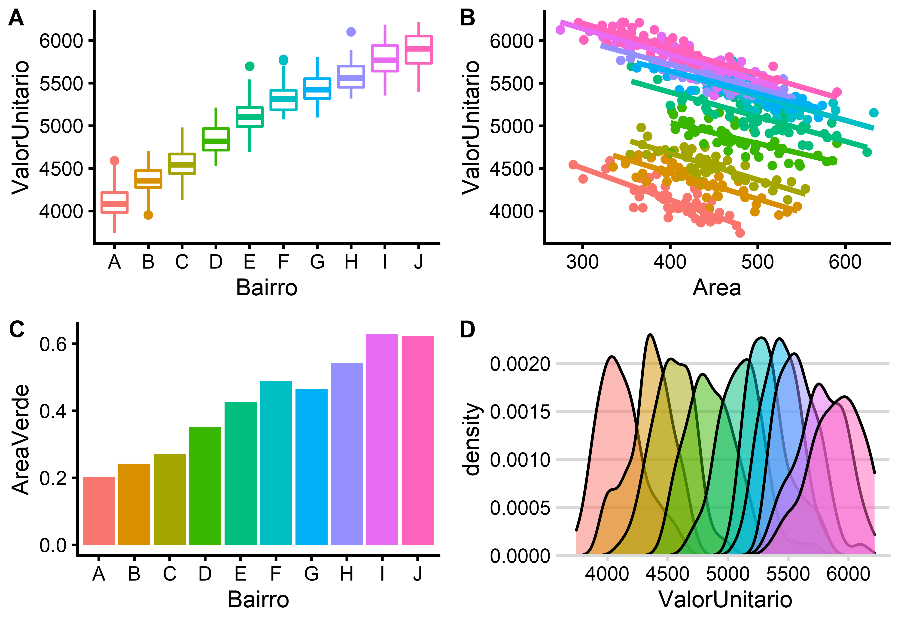
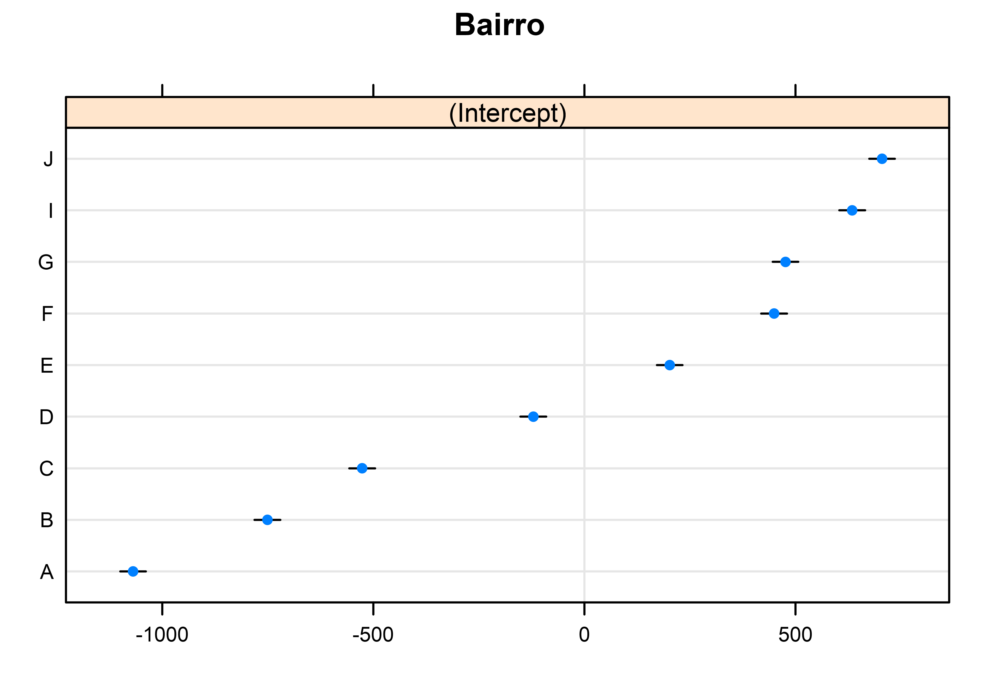
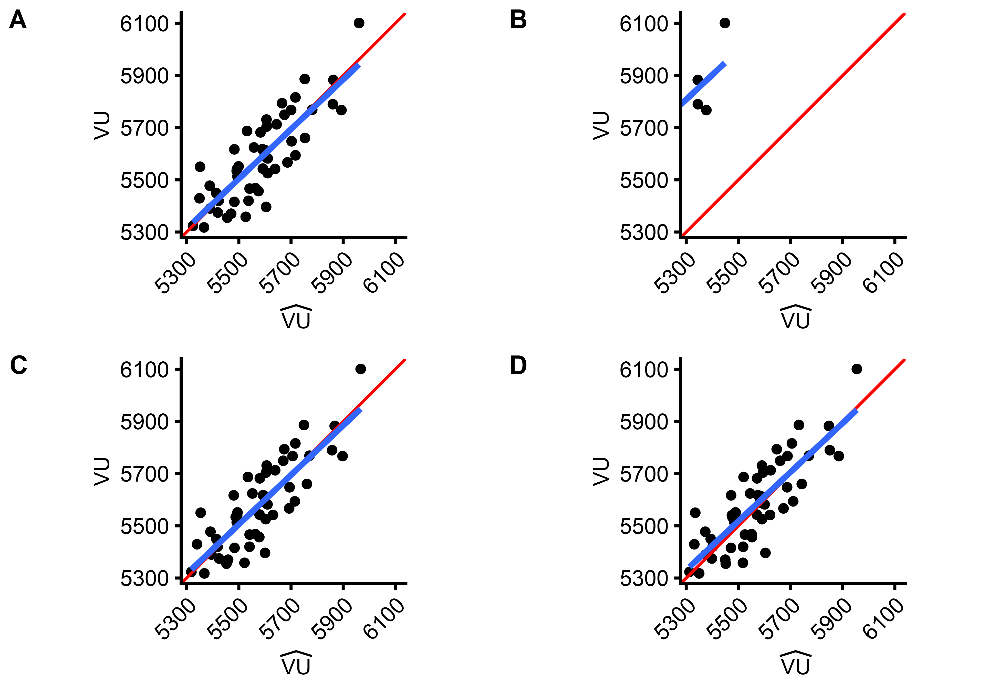

```{r,setup, include=FALSE}
knitr::opts_chunk$set(cache=TRUE, echo = FALSE, warning = FALSE, message = FALSE,                       out.width = "50%", fig.align = "center")
library(tibble)
library(lme4)
library(sjmisc)
library(stargazer)
library(lattice)
```

# Introdução

## Amostras heterogêneas

>- \alert<1>{Modelos mistos são modelos estatísticos que misturam efeitos fixos 
(FE) e efeitos aleatórios (RE), capazes de lidar com a heterogeneidade amostral 
\footcite{bell2019}.}
>   + \alert<2>{\begin{equation}
y_{ij} = \beta_0 + \beta_1^{RE} x_{ij} + \beta_2 z_j + (\upsilon_j + \varepsilon_{ij})
\end{equation}}
>   + \alert<3>{$\upsilon_j \sim \mathcal N(0, \sigma^2_{\upsilon})$ e 
$\varepsilon_{ij} \sim \mathcal N(0, \sigma^2_{\varepsilon})$}

>- \alert<4>{Existem outras maneiras de modelar amostras heterogêneas}
>   + \alert<5>{Modelos de Efeitos Fixos (FE): variância entre agrupamentos $\infty$}
>      + \alert<6>{\begin{equation}
y_{ij} = \sum_{j=1}^{j}\beta_{0j}D_j + \beta_1 x_{ij} + \varepsilon_{ij}
\end{equation}}
>   + \alert<7>{Modelos OLS: ignorar a heterogeneidade}
>     + \alert<8>{\begin{equation}
y_{ij} = \beta_0 + \beta_1^{OLS} x_{ij} + \beta_2 z_j + \varepsilon_{ij}
\end{equation}}
>     + \alert<9>{Pode levar a não verificação de várias hipóteses da 
inferência clássica, como a independência das observações.}


## Efeitos Fixos vs. Efeitos Aleatórios

>- \alert<1>{A utilização de uma ou outra abordagem vai depender do objetivo da
modelagem e da composição da amostra.}
>- \alert<2>{Na avaliação de precisão de um imóvel em específico, a partir de
uma amostra heterogênea, com dados de poucos agrupamentos, onde não haja
interesse em \emph{explicar} porque os dados de um agrupamento apresentam
valores diferentes, em média, dos dados de outros agrupamentos.}
>   + \alert<3>{O modelo de efeitos fixos é ideal.}
>   + \alert<4>{Um número mínimo de dados em cada agrupamento, no entanto, é
necessário para uma boa estimação.}

>- \alert<5>{Na elaboração de PVGs, onde estão disponíveis dados em uma grande
quantidade de agrupamentos (não necessariamente todos), porém seja necessária a 
previsão de valores em agrupamentos fora da amostra.}
>   + \alert<6>{O modelo de efeitos aleatórios deve ser utilizado, já que a 
modelagem por efeitos fixos não pode \emph{explicar} a diferença de níveis entre 
os agrupamentos, impossibilitando a previsão de valores em agrupamentos fora da
amostra.}
>   + \alert<7>{Estimação em agrupamentos com pequeno $n_j$ é beneficiada pelo 
efeito do encolhimento (\emph{borrowing strenght}\footcite[p. 196]{tukey}).}

## Modelagem hierárquica

>- \alert<1>{Modelos hierárquicos ou multiníveis são modelos cujas equações 
podem ser escritas separadamente, dividindo a modelagem em diversos níveis de
análise.}
>- \alert<2>{Apesar do modelo ser escrito em diversos níveis, a estimação é feita
de uma só vez, a partir da substituição das equações}
>   + \alert<3>{P. Ex.: 
\begin{align}
y_{ij} &= \beta_{0j} + \beta_1^{RE}x_{ij} + \varepsilon_{ij}\\
\beta_{0j} &= \beta_0 + \beta_2 z_j + \upsilon_j \\
y_{ij} &= \beta_0 + \beta_1^{RE} x_{ij} + \beta_2 z_j + (\upsilon_j + \varepsilon_{ij})
\end{align}
}
>- \alert<4>{Possibilidade de modelagem de diversos níveis aninhados.}
>- \alert<5>{Todo modelo hierárquico é um modelo misto.}
>- \alert<6>{Nem todo modelo misto é um modelo hierárquico.}


# Inclinações Aleatórias

>- \alert<1>{Os modelos mistos são mais flexíveis que os modelos fixos.}
>- \alert<2>{É fácil introduzir inclinações aleatórias, p. ex.}
>     + \alert<3>{\begin{equation}
y_{ij} = (\beta_0 + \upsilon_j) + (\beta_1 + \nu_j) x_{ij} + \beta_2 z_j + \varepsilon_{ij}
\end{equation}}
>     + \alert<4>{Apenas um grau de liberdade a mais é consumido}
>- \alert<5>{Para obtenção de uma modelagem análoga com a abordagem de efeitos fixos, seria necessário modelar a interação entre as variáveis \emph{dummies} e 
a variável com inclinações aleatórias.}
>- \alert<6>{Processo é custoso em graus de liberdade e pode prejudicar uma boa
estimação dos coeficientes.}


## Encolhimento (borrowing strenght)

```{r, fig.cap="Encolhimento em modelos mistos \\footcite{jones1994}.", out.width="70%"}

```

## Encolhimento (borrowing strenght) (2)

```{r, fig.cap="Encolhimento em modelos mistos (2) \\footcite{jones1994}.", out.width="70%"}

```

## Encolhimento (borrowing strenght) (3)

```{r}

```


# Limitações e outras formulações

>- \alert<1>{A formação de efeitos aleatórios supõe que \footcite[p. 138]{bell2015}:}
>     + \alert<2>{$Cov(x_{ij}; u_j) = 0$ e $Cov(x_{ij}; e_{ij}) = 0$}
>- \alert<3>{Estas hipóteses frequentemente não se verificam$^4$.}
>- \alert<4>{No entanto, é possível contornar este problema:}
>     + \alert<5>{Formulação de Mundlak \footcite[p. 141]{bell2015}:
\begin{align}
y_{ij} &= \beta_{0j} + \beta_1^{RE}x_{ij} + \varepsilon_{ij}\\
\beta_{0j} &= \beta_0 + \beta_2 z_j + \beta_3 \bar x_{ij} + \upsilon_j 
\end{align}
}
>     + \alert<6>{Formulação REWB$^5$:
\begin{align}
y_{ij} &= \beta_{0j} + \beta_1^{RE}x_{ij} + \varepsilon_{ij}\\
\beta_{0j} &= \beta_0 + \beta_2 z_j + (\beta_4 - \beta_1) \bar x_{ij} + \upsilon_j\\ 
y_{ij} &= \beta_0 + \beta_1 (x_{ij} - \bar x_j) + \beta_4 \bar x_{ij} + \beta_2 z_j + (\upsilon_j + \varepsilon_{ij})
\end{align}
}

# Estudo de Caso

## Criação dos dados

\begin{align}
ValorUnitario &= \beta_{0j} - 3,0 \cdot Area + \varepsilon_{ij}  \label{eq:EC1}\\
\beta_{0j} &= 3000 + 4000 \cdot A_{Vj} + 5,0 \cdot \overline{Area_j} + \upsilon_j \label{eq:EC2}
\end{align}


```{r, fig.cap="Dados simulados. Fonte: Os autores", out.width="50%"}

```

```{r}
# Simulação de dados
seed <- 1
set.seed(seed)
# Dados por bairro
a <- 50
# Número de bairros
b <- 10
# Variáveis de nível 1
#
# Área
#
A <- rnorm(a*b, mean = 400, sd = 50) + c(rep(seq(0, 100, 25), each = a), rep(seq(100, 0, -25), each = a))
#
# Variáveis de nível 2
#
# Área livre
Av <- rep(seq(.2, .65, .05), each = a)
#
```

```{r}
dados <- tibble(Area = A,
                AreaVerde = rep(seq(.2, .65, .05) + rnorm(10, 0, .025), each = a),
                Bairro = factor(rep(LETTERS[1:b], each=a))
                )
dados <- as_tibble(dados)
dados <- de_mean(dados, "Area", grp = "Bairro")
dados$Area_center <- as.numeric(scale(dados$Area, center = 400, scale = FALSE))
#
# Equação de segundo nível
#
beta_zero <- 2500
beta_zeroj <- beta_zero + 4000*Av + 5*dados$Area_gm  + rnorm(b*a, mean = 0, sd = 50)
#
# Equação mista
#
dados$ValorUnitario <- beta_zeroj - 3*dados$Area + rnorm(b*a, mean = 0, sd = 100)
#
#
bairroH <- which(dados$Bairro == "H")
newdata <- dados[bairroH, ]
amostra <- dados[setdiff(1:550, bairroH), ]
```

## Ajuste de modelos

```{r}
fit <- lm(ValorUnitario ~ Area_center + Bairro - 1, data = dados)
fit$AIC <- AIC(fit)
fit$BIC <- BIC(fit)
```

```{r simpleMixedModel}
fit_lmer <- lmer(ValorUnitario ~ Area_center + (1|Bairro), data = amostra)
s <- summary(fit_lmer)
re <- ranef(fit_lmer)
fe <- fixef(fit_lmer)
pr <- profile(fit_lmer)
```

```{r 2ndlevelModel}
fit_lmer2 <- lmer(ValorUnitario ~ Area_center + AreaVerde + (1|Bairro), 
                  data = amostra)
s1 <- summary(fit_lmer2)
re1 <- ranef(fit_lmer2)
fe1 <- fixef(fit_lmer2)
pr1 <- profile(fit_lmer2)
```

```{r mundlakModel}
mundlak <- lmer(ValorUnitario ~ Area + Area_gm + AreaVerde + (1|Bairro), data = amostra)
s2 <- summary(mundlak)
re2 <- ranef(mundlak)
fe2 <- fixef(mundlak)
pr2 <- profile(mundlak)
```

>- Para o ajuste dos modelos mistos não foram incluídos dados do bairro H.

```{r, out.width="80%"}

```


```{r, results='asis', include=FALSE}
stargazer(fit, fit_lmer, fit_lmer2, mundlak, header = FALSE,  
          type = "latex", decimal.mark = ",", digit.separator = ".", digits = 2,
          title = "Comparacão dos modelos de  efeitos fixos e efeitos mistos.",
          label = "tab:fits",
          intercept.bottom = FALSE, intercept.top = TRUE, report = "vcs*", 
          single.row = TRUE, star.cutoffs = c(0.30, 0.20, 0.10),
          omit.stat = c("rsq", "adj.rsq", "ser","f"), table.placement = "H",
          font.size = "tiny",
          covariate.labels = c("Intercepto", "(Area - 400)", 
                               paste("Bairro", LETTERS[1:10]), "Area", 
                               "Area (contexto)", "Area Verde"))
```

## Modas Condicionais

>- Para o modelo misto simples, a variação não-explicada *entre* os agrupamentos
é alta!

```{r, fig.cap = "Modas Condicionais do modelo misto simples.", results='hide', out.width="60%"}

dotplot(ranef(fit_lmer))
```


## Modas Condicionais

>- Com variáveis de segundo nível, a variação não-explicada *entre* os agrupamentos é reduzida!

```{r, fig.cap = "Modas Condicionais do modelo misto com variável de 2º nível.",, results='hide', out.width="60%"}
#
dotplot(ranef(fit_lmer2))
```

## Modas Condicionais

>- Com a formulação de Mundlak, a variação não-explicada *entre* os agrupamentos é reduzida ainda mais!

```{r, fig.cap = "Modas Condicionais do modelo misto com variável de 2º nível.",, results='hide', out.width="60%"}
#
dotplot(ranef(mundlak))
```


## Densidade dos parâmetros estimados

>- Para o modelo misto simples, a variação não-explicada *entre* os agrupamentos
($\sigma_1$) é alta!

```{r, fig.cap = "Densidades dos parâmetros estimados pelo modelo misto simples.", out.width="40%"}

```

## Densidade dos parâmetros estimados

>- Com a introdução de variáveis de segundo nível, há redução da variação não-explicada *entre* os agrupamentos ($\sigma_1$)!

```{r, fig.cap = "Densidades dos parâmetros estimados pelo modelo misto com variável de 2º nível."}
knitr::include_graphics("../../images/pr1-1.png")
```

## Densidade dos parâmetros estimados

>- Com a formulação de Mundlak, há redução ainda maior da variação não-explicada
*entre* os agrupamentos ($\sigma_1$)!

```{r, fig.cap = "Densidades dos parâmetros estimados pelo modelo com formulação de Mundlak."}
knitr::include_graphics("../../images/pr2-1.png")
```


## Previsão de valores

>- Modelos com variáveis de segundo nível capazes de prever valores em
agrupamentos fora da amostra!

```{r, fig.cap="Poder de predição para o bairro H em diversos modelos. Fonte: Os autores."}

```

## Intervalos de Predição

```{r}


```

# Conclusões

>- \alert<1>{Os modelos mistos podem ter importantes aplicações na Engenharia de
Avaliações, desde que seja adotada a formulação adequada}
>     + \alert<2>{Nos laudos de precisão, devido ao \emph{borrowing strenght}}
>     + \alert<3>{Na avaliação em massa, devido ao alto número de diferentes
agrupamentos e à facilidade para modelagem de inclinações aleatórias}
>     + \alert<4>{Na previsão do valor do solo em áreas adensadas, devido à 
possibilidade de previsão de valores em agrupamentos fora da amostra}
>     + \alert<5>{Na análise de dados em séries temporais ou em painel, devido à
possibilidade de separação dos efeitos \emph{dentro} e \emph{entre} os 
agrupamentos (REWB)}
>     + \alert<6>{Na confecção de índices de preços}

# Trabalhos Futuros

## Modelagem de diversos níveis hierárquicos

\begin{align*}
VU_{ijk}  &= \beta_{0jk} + \beta_{1jk} V_{1ijk} + \beta_{2jk} V_{2ijk} + \cdots + r_{ijk}\\ 
\beta_{0jk} &= \gamma_{00k} + \gamma_{01k}W_{1jk} + \gamma_{02k}W_{2jk} + \cdots+ s_{0jk}\\ 
\beta_{1jk} &= \gamma_{10k} + \gamma_{11k}W_{1jk} + \gamma_{12k}W_{2jk} + \cdots+ s_{1jk}\\ 
\vdots \\
\gamma_{00k} &= \eta_{000} + \eta_{001} X_{1k} + \eta_{002} X_{2k} + \cdots +  t_{00k}\\ 
\gamma_{01k} &= \eta_{010} + \eta_{011} X_{1k} + \eta_{012} X_{2k} + \cdots +  t_{01k}\\ 
\vdots
\end{align*}

# Referências
